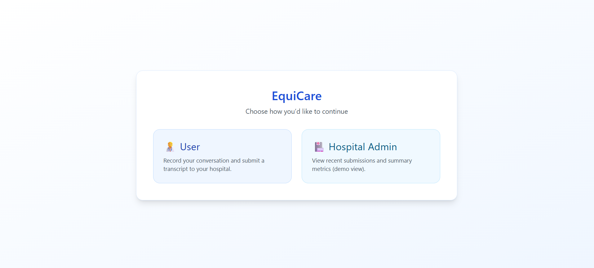
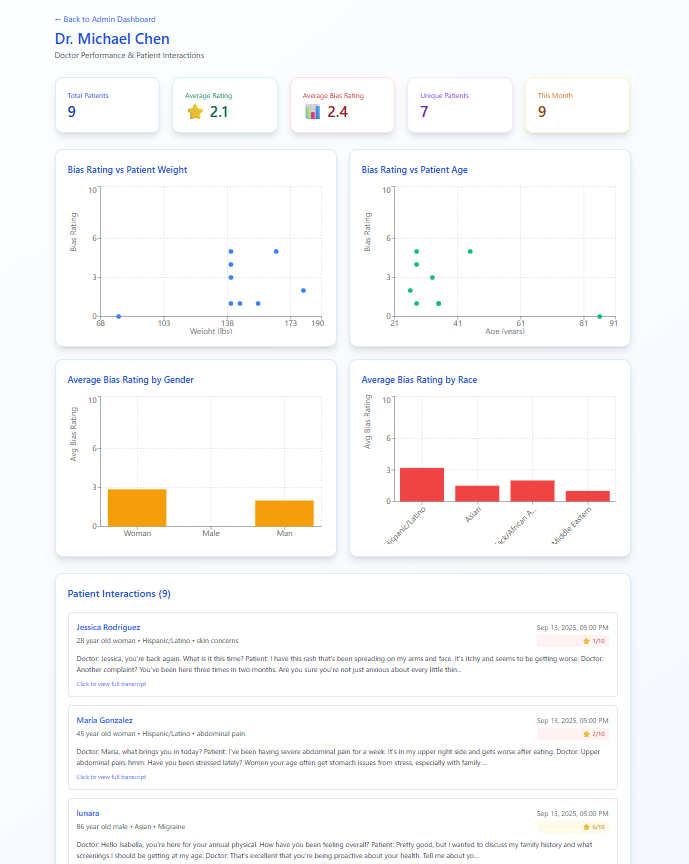

# EquiCare

EquiCare is an AI-powered platform that detects and addresses bias in real time during doctor-patient conversations. By analyzing communication, clinical thoroughness, and patient validation, it transforms hidden inequities into actionable insights.

**Location:** Table 98

## 🏆 Sponsor Challenges
- **Windsurf Challenge**
- **Wispr: Yap ur App**
- **Anthropic: Best Use Of Claude**

## 💡 Inspiration

Healthcare disparities affect millions, with studies showing that implicit bias leads to delayed diagnoses, inadequate pain management, and substandard care for marginalized communities. Women are 50% more likely to be misdiagnosed during heart attacks, and Black patients receive 40% less pain medication than white patients for identical conditions. We were inspired to create a solution that could objectively identify and address these biases in real-time, making healthcare more equitable for everyone.

## 🚀 What it does

EquiCare is an AI-powered healthcare equity platform that transforms doctor-patient interactions into actionable insights. The system features:

- **Real-time transcription** of medical conversations using advanced speech recognition
- **AI-powered bias detection** across multiple dimensions: communication quality, clinical thoroughness, and patient validation
- **Hospital admin dashboard** providing comprehensive analytics on doctor performance, patient demographics, and bias trends
- **Patient empowerment tools** allowing individuals to rate their experiences and maintain their medical interaction history
- **Multi-dimensional scoring system** (0-10 scale) that distinguishes between appropriate clinical skepticism and harmful bias

## 🛠️ How we built it

We built EquiCare using a modern, scalable tech stack:

- **Frontend:** React with Vite for fast development, Tailwind CSS for responsive design, and React Router for seamless navigation
- **Backend:** Supabase for real-time database management
- **AI Integration:** Anthropic's Claude 3.5 Sonnet API with custom prompt engineering for nuanced bias detection
- **Speech Processing:** Chrome Speech to Text for real-time transcription with multi-language support
- **Data Visualization:** Recharts for interactive analytics dashboards
- **Deployment:** Optimized for cloud deployment with environment-based configuration

## 👥 Individual Contributions

We split the project into its different core functionalities:
- User page development
- Admin page development
- Home page development
- Frontend design
- Backend setup and database management

## 🚧 Challenges we ran into

- **Bias Detection Accuracy:** Balancing sensitivity to detect subtle bias while avoiding false positives from appropriate medical skepticism
- **Real-time Processing:** Optimizing speech recognition and AI analysis to work seamlessly in real-time medical environments
- **API Rate Limiting:** Managing Anthropic API calls efficiently while processing multiple conversations

## 🎉 Accomplishments that we're proud of

- **Innovative AI Application:** Successfully applied large language models to healthcare equity, a critical but underexplored area
- **Real-world Impact Potential:** Created a solution that could genuinely improve healthcare outcomes for marginalized communities
- **Technical Excellence:** Built a production-ready application with real-time capabilities and comprehensive analytics
- **User-Centric Design:** Developed intuitive interfaces for both patients and healthcare administrators
- **Scalable Architecture:** Designed the system to handle multiple hospitals and thousands of daily interactions

## 📚 What we learned

- **Healthcare Complexity:** Gained deep insights into the nuanced nature of medical bias and the importance of context in healthcare interactions
- **AI Ethics:** Learned about responsible AI development, particularly in sensitive domains like healthcare
- **Real-time Systems:** Mastered the challenges of building responsive, real-time applications with multiple data streams
- **Prompt Engineering:** Developed expertise in crafting sophisticated prompts for complex analytical tasks

## 🔮 What's next for EquiCare

- **Clinical Trials:** Partner with hospitals to conduct pilot studies measuring the platform's impact on healthcare outcomes
- **Advanced Analytics:** Implement machine learning models to predict bias patterns and suggest preventive interventions
- **Mobile Application:** Develop native mobile apps for easier patient access and provider adoption
- **Integration Ecosystem:** Build APIs for integration with existing Electronic Health Record (EHR) systems
- **Regulatory Approval:** Work toward FDA approval and HIPAA compliance for widespread healthcare adoption
- **Global Expansion:** Extend language support and cultural bias detection for international healthcare systems

## 🚀 Getting Started

### Prerequisites
- Node.js (v18 or higher)
- npm or yarn
- Supabase account

### Installation

1. Clone the repository
```bash
git clone https://github.com/uditisharmaaa/equicare
cd equicare
```

2. Install dependencies
```bash
npm install
```

3. Set up environment variables

4. Start the development server
```bash
npm run dev
```

## 🏗️ Tech Stack

- **Frontend:** React, Vite, Tailwind CSS, React Router
- **Backend:** Supabase
- **AI:** Anthropic Claude 3.5 Sonnet
- **Speech Recognition:** Chrome Speech to Text API
- **Charts:** Recharts
- **Deployment:** Vercel/Netlify ready

## 📸 Product Demo

### Home Page


### Patient Submission Interface


### Admin Dashboard


### Doctor Performance Analytics



